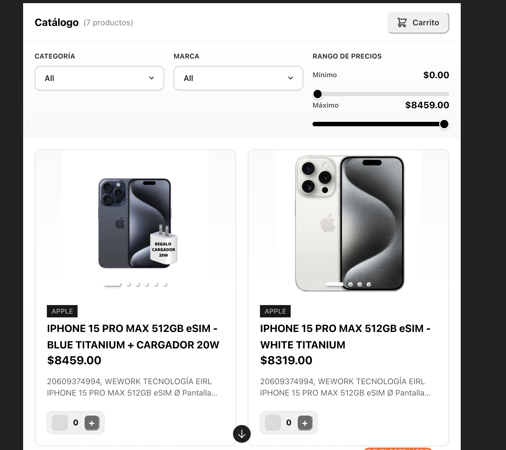
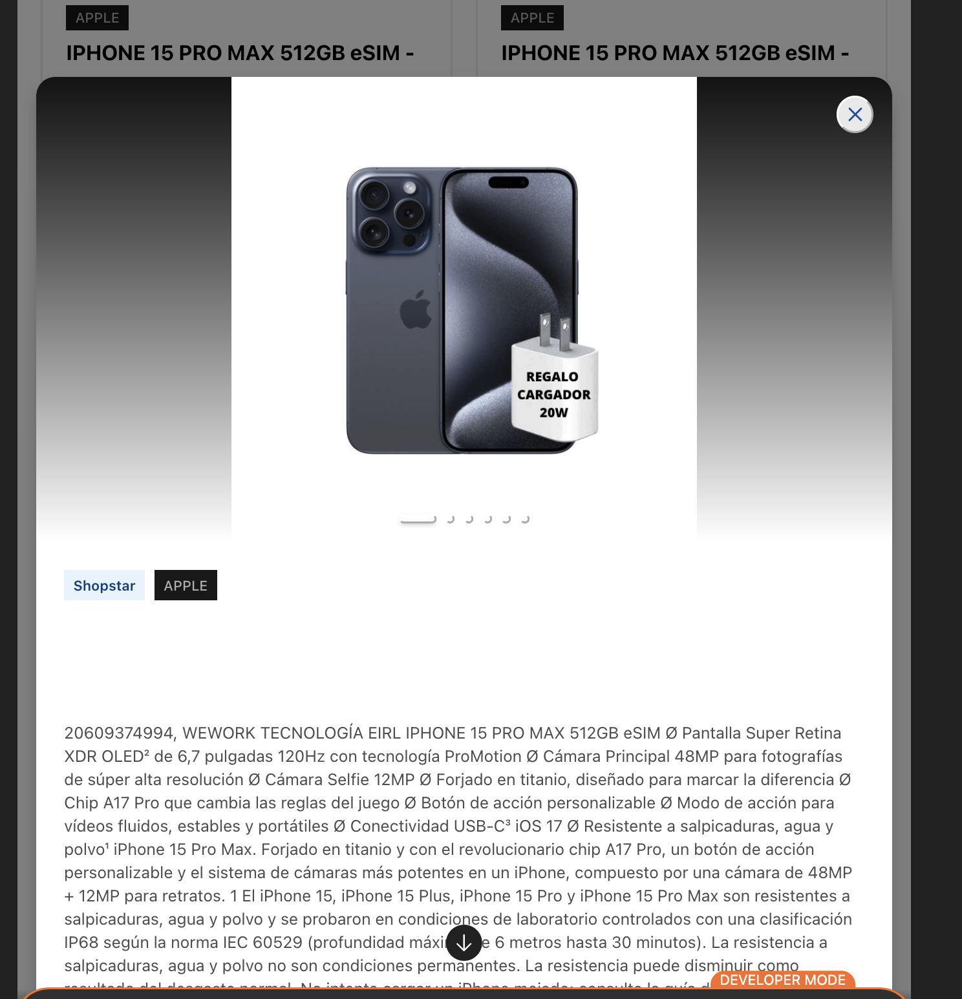
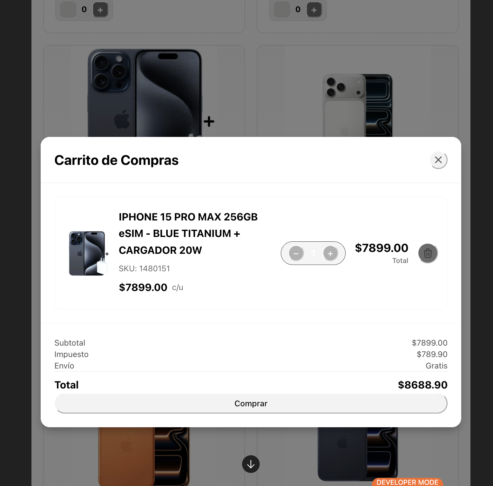
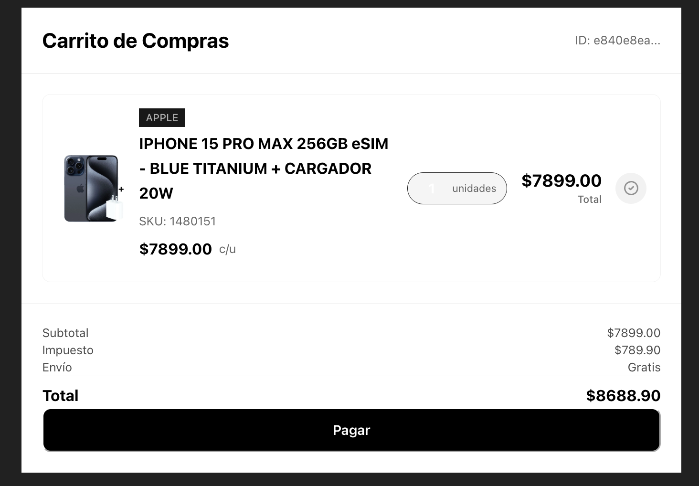

# MCP E-Commerce Server

A modern e-commerce MCP (Model Context Protocol) Server built with .NET 10, following Clean Architecture principles, Domain-Driven Design (DDD), CQRS pattern, and Vertical Slice Architecture. Features a React frontend using OpenAI Apps SDK UI for interactive widgets within ChatGPT.

## 🏗️ Architecture

This platform follows **Clean Architecture** with clear separation of concerns:

- **Domain Layer**: Core business entities and interfaces
- **Application Layer**: CQRS handlers (Commands/Queries), business logic, interfaces
- **Infrastructure Layer**: Persistence, external services (VTEX API), implementations
- **Server Layer**: MCP Tools, MCP Resources, HTTP endpoints, static file serving

### Architecture Principles

- **Clean Architecture**: Clear separation of concerns across layers
- **Domain-Driven Design (DDD)**: Domain-centric design with rich domain models
- **CQRS**: Command Query Responsibility Segregation using MediatR
- **Vertical Slice Architecture**: Feature-based organization (Catalog, Checkout, Sellers)
- **MCP Protocol**: Model Context Protocol for AI agent integration
- **Headless**: API-first approach with React widgets for UI

## 🛠️ Technology Stack

### Backend
- **.NET 10**: Target framework
- **.NET Aspire 13.1.0**: Application orchestration (optional)
- **C#**: Primary programming language
- **ModelContextProtocol**: MCP SDK for .NET (v0.4.0-preview.3)
- **MediatR**: CQRS implementation
- **FluentValidation**: Input validation
- **AutoMapper**: Object mapping
- **StackExchange.Redis**: Redis client for caching

### Frontend
- **React 18.3**: UI framework
- **TypeScript**: Type-safe JavaScript
- **Vite**: Build tool and dev server
- **Tailwind CSS 4**: Utility-first CSS framework
- **OpenAI Apps SDK UI**: Component library for ChatGPT widgets
- **React Hooks**: Custom hooks for OpenAI integration (`useOpenAiGlobal`, `useWidgetProps`, `useWidgetState`)

### Infrastructure
- **ASP.NET Core**: Web framework
- **HTTP Transport**: MCP server over HTTP with Server-Sent Events (SSE)
- **Static File Serving**: React widgets served as static HTML/JS/CSS
- **CORS**: Configured for ChatGPT UI and ngrok
- **VTEX Integration**: E-commerce platform API integration

## 📁 Project Structure

```
mcp-ecommerce/
├── aspire/
│   └── AppHost/              # Aspire orchestration host (optional)
├── src/
│   ├── Backend/
│   │   ├── Domain/           # Domain entities and interfaces
│   │   │   ├── Catalog/      # Product domain
│   │   │   ├── Checkout/     # Order, Cart domain
│   │   │   └── Sellers/      # Seller domain
│   │   ├── Application/       # CQRS handlers and business logic
│   │   │   ├── Catalog/      # Catalog queries
│   │   │   ├── Checkout/     # Checkout commands/queries
│   │   │   └── Sellers/      # Seller queries
│   │   ├── Infrastructure/   # External services and persistence
│   │   │   ├── Catalog/      # Product repositories (InMemory, VTEX)
│   │   │   ├── Checkout/     # Order repositories
│   │   │   └── Sellers/      # Seller repositories
│   │   └── Server/           # MCP Tools, Resources, HTTP server
│   │       ├── Catalog/
│   │       │   ├── McpTools/      # MCP Tools (catalog_list, etc.)
│   │       │   └── McpResources/  # MCP Resources (HTML widgets)
│   │       ├── Checkout/
│   │       └── Helpers/       # HTML sanitization, static files
│   └── Frontend/
│       └── react-app/         # React frontend
│           ├── src/
│           │   ├── components/
│           │   │   └── widgets/    # React widgets (CatalogWidget, CartModal, etc.)
│           │   ├── hooks/          # Custom React hooks
│           │   └── widgets/        # Widget entry points
│           └── wwwroot/            # Compiled output (served by Server)
├── scripts/                  # Development and testing scripts
├── Directory.Packages.props   # Central package management
├── Directory.Build.props      # Common build properties
└── Makefile                   # Development automation
```

## 🚀 Getting Started

### Prerequisites

- **.NET 10 SDK** or later
- **Node.js 20+** and npm
- **Docker Desktop** (optional, for Redis via Aspire)
- **Visual Studio 2022** or **VS Code** / **Rider** (recommended)

### Installation

1. **Clone the repository**
   ```bash
   git clone <repository-url>
   cd mcp-ecommerce
   ```

2. **Install dependencies**
   ```bash
   make install
   # Or manually:
   cd src/Frontend/react-app && npm install
   dotnet restore
   ```

3. **Build the solution**
   ```bash
   make build
   # Or manually:
   make build-frontend  # Build React frontend
   make build-backend   # Build .NET backend
   ```

### Running the Application

#### Using Makefile (Recommended)

```bash
# Run HTTP server + MCP server (default)
make run
# Or
make dev

# Run only HTTP server
make dev-http

# Run with frontend watch mode
make dev-full

# Open catalog widget in browser (requires server running)
make open-widget
```

#### Using .NET CLI

```bash
# Run the server (HTTP + MCP)
dotnet run --project src/Backend/Server/Server.csproj
```

The server will be available at:
- **HTTP Server**: `http://localhost:4444`
- **MCP Endpoint**: `http://localhost:4444/mcp`
- **Static Files**: `http://localhost:4444/` (serves React widgets)

### Testing MCP Tools and Resources

```bash
# List all available MCP Tools
make test-tools

# Verify _meta is present in tools/list response
make test-meta

# Test MCP Resources
make test-resources
```

## 📋 Features

### MCP Tools

The server exposes the following MCP Tools:

#### Catalog Tools
- **`catalog_list`**: List products with filtering (category, brand, search term, pagination)
  - Returns structured product data with images, prices, stock, features
  - Supports `shopKey` parameter (required) - use `get_available_sellers` first
- **`get_available_categories`**: List all available product categories for a shop
- **`get_available_brands`**: List all available product brands for a shop
- **`compare_products`**: Compare multiple products side-by-side

#### Seller Tools
- **`get_available_sellers`**: List all available sellers (shops)
  - **IMPORTANT**: Use this tool FIRST to get `shopKey` before calling catalog tools

### MCP Resources

The server exposes HTML widgets as MCP Resources:

- **`ui://widget/catalog.html`**: Interactive product catalog widget
  - Product cards with images, prices, stock
  - Category and brand filters
  - Price range slider
  - Shopping cart integration
  - Product detail modal
- **`ui://widget/product-comparison.html`**: Product comparison widget

### Frontend Widgets

React widgets built with OpenAI Apps SDK UI:

- **CatalogWidget**: Main product catalog with filters and cart
- **ProductDetailModal**: Product details with image carousel
- **CartModal**: Shopping cart with checkout summary
- **ImageCarousel**: Multi-image carousel component

### Product Repositories

- **InMemoryProductRepository**: In-memory product data (development/testing)
- **VtexProductRepository**: VTEX e-commerce platform integration
  - Configure via `appsettings.json`: `ProductRepository:Type = "Vtex"`
  - Supports multiple sellers via `shopKey` parameter

## 🎨 Feature Showcase

This section demonstrates the key features of the MCP E-Commerce platform with real-world examples of LLM interactions and MCP Tool responses.

### 1. Catalog Listing with Filters

**Feature Type**: Product Catalog Widget with Advanced Filtering

**Description**: Displays an interactive product catalog with filtering capabilities including category dropdown, brand dropdown, and price range slider. Products are displayed in a grid layout with images, prices, stock status, and brand badges. Supports skeleton loading states and real-time filtering.



**Example LLM Interaction**:
```
User: "Muéstrame el catálogo de productos de Shopstar"

LLM: "Voy a obtener la lista de tiendas disponibles y luego mostrar el catálogo de Shopstar."
```

**MCP Tool Call**:
```json
{
  "method": "tools/call",
  "params": {
    "name": "catalog_list",
    "arguments": {
      "shopKey": "mercury",
      "page": 1,
      "pageSize": 20
    }
  }
}
```

**MCP Tool Result**:
```json
{
  "_meta": {
    "openai/outputTemplate": "ui://widget/catalog.html",
    "openai/widgetAccessible": true,
    "openai/resultCanProduceWidget": true
  },
  "structuredContent": {
    "status": "completed",
    "products": [
      {
        "id": "1480151",
        "name": "IPHONE 15 PRO MAX 256GB eSIM - BLUE TITANIUM + CARGADOR 20W",
        "description": "IPHONE 15 PRO MAX 256GB eSIM Ø Pantalla Super Retina XDR OLED²...",
        "price": 7899.00,
        "sku": "1480151",
        "category": "Smartphones",
        "brand": "APPLE",
        "sellerName": "Shopstar",
        "shopKey": "mercury",
        "imageUrls": [
          "https://mercury.vtexcommercestable.com.br/arquivos/ids/123456-500-auto.jpg"
        ],
        "stock": 10,
        "features": ["Pantalla Super Retina XDR", "Cámara 48MP", "Chip A17 Pro"]
      }
    ],
    "totalCount": 7,
    "page": 1,
    "pageSize": 20,
    "sellerName": "Shopstar",
    "shopKey": "mercury"
  }
}
```

---

### 2. Product Detail Modal

**Feature Type**: Product Detail View with Image Carousel

**Description**: Displays detailed product information in a modal overlay, including multiple product images in a carousel, brand and seller badges, full product description, price, stock availability, and an "Agregar al Carrito" button. The modal is optimized for visibility within ChatGPT's interface.



**Example LLM Interaction**:
```
User: "Muéstrame los detalles del iPhone 15 Pro Max de 256GB"

LLM: "Voy a mostrar los detalles completos del producto incluyendo imágenes y especificaciones."
```

**MCP Tool Call**:
```json
{
  "method": "tools/call",
  "params": {
    "name": "catalog_list",
    "arguments": {
      "shopKey": "mercury",
      "searchTerm": "IPHONE 15 PRO MAX 256GB"
    }
  }
}
```

**MCP Tool Result**:
```json
{
  "_meta": {
    "openai/outputTemplate": "ui://widget/catalog.html",
    "openai/widgetAccessible": true,
    "openai/resultCanProduceWidget": true
  },
  "structuredContent": {
    "status": "completed",
    "products": [
      {
        "id": "1480151",
        "name": "IPHONE 15 PRO MAX 256GB eSIM - BLUE TITANIUM + CARGADOR 20W",
        "description": "20609374994, WEWORK TECNOLOGÍA EIRL IPHONE 15 PRO MAX 256GB eSIM Ø Pantalla Super Retina XDR OLED² de 6,7 pulgadas 120Hz con tecnología ProMotion Ø Cámara Principal 48MP para fotografías de súper alta resolución Ø Cámara Selfie 12MP Ø Forjado en titanio, diseñado para marcar la diferencia Ø Chip A17 Pro que cambia las reglas del juego...",
        "price": 7899.00,
        "sku": "1480151",
        "category": "Smartphones",
        "brand": "APPLE",
        "sellerName": "Shopstar",
        "shopKey": "mercury",
        "imageUrls": [
          "https://mercury.vtexcommercestable.com.br/arquivos/ids/123456-500-auto.jpg",
          "https://mercury.vtexcommercestable.com.br/arquivos/ids/123457-500-auto.jpg"
        ],
        "stock": 10
      }
    ]
  }
}
```

---

### 3. Shopping Cart Modal

**Feature Type**: Shopping Cart Overlay with Order Summary

**Description**: Displays a modal overlay showing the current shopping cart contents with product details, quantity selectors, item totals, and a complete order summary including subtotal, tax, shipping, and final total. Includes a "Pagar" (Pay) button to proceed with checkout.



**Example LLM Interaction**:
```
User: "Muéstrame mi carrito de compras"

LLM: "Voy a obtener el estado actual de tu carrito y mostrártelo."
```

**MCP Tool Call**:
```json
{
  "method": "tools/call",
  "params": {
    "name": "get_cart",
    "arguments": {
      "cartId": "e840e8ea-1234-5678-9abc-def012345678"
    }
  }
}
```

**MCP Tool Result**:
```json
{
  "_meta": {
    "openai/outputTemplate": "ui://widget/cart.html",
    "openai/widgetAccessible": true,
    "openai/resultCanProduceWidget": true,
    "openai/widgetSessionId": "e840e8ea-1234-5678-9abc-def012345678"
  },
  "structuredContent": {
    "status": "completed",
    "cartId": "e840e8ea-1234-5678-9abc-def012345678",
    "items": [
      {
        "productId": "1480151",
        "productName": "IPHONE 15 PRO MAX 256GB eSIM - BLUE TITANIUM + CARGADOR 20W",
        "productSku": "1480151",
        "quantity": 1,
        "unitPrice": 7899.00,
        "totalPrice": 7899.00,
        "imageUrl": "https://mercury.vtexcommercestable.com.br/arquivos/ids/123456-500-auto.jpg",
        "category": "Smartphones",
        "brand": "APPLE",
        "sellerName": "Shopstar",
        "shopKey": "mercury"
      }
    ],
    "subTotal": 7899.00,
    "tax": 789.90,
    "shipping": 0.00,
    "total": 8688.90,
    "totalItems": 1
  }
}
```

---

### 4. Shopping Cart Widget

**Feature Type**: Dedicated Cart Widget with Pricing Breakdown

**Description**: A standalone widget displaying the shopping cart with a clean, modern design. Shows cart header with item count, product cards with images and details, quantity selectors, item totals, and a comprehensive pricing breakdown (subtotal, tax, shipping, total). Features a prominent "Pagar" button for checkout completion.



**Example LLM Interaction**:
```
User: "Abre el widget del carrito para ver mi resumen de compra"

LLM: "Voy a abrir el widget del carrito con todos los detalles de tu compra."
```

**MCP Tool Call**:
```json
{
  "method": "tools/call",
  "params": {
    "name": "open_cart_widget",
    "arguments": {
      "cartId": "e840e8ea-1234-5678-9abc-def012345678"
    }
  }
}
```

**MCP Tool Result**:
```json
{
  "_meta": {
    "openai/outputTemplate": "ui://widget/cart.html",
    "openai/widgetAccessible": true,
    "openai/resultCanProduceWidget": true,
    "openai/widgetSessionId": "e840e8ea-1234-5678-9abc-def012345678"
  },
  "structuredContent": {
    "status": "completed",
    "cartId": "e840e8ea-1234-5678-9abc-def012345678",
    "items": [
      {
        "productId": "1480151",
        "productName": "IPHONE 15 PRO MAX 256GB eSIM - BLUE TITANIUM + CARGADOR 20W",
        "productSku": "1480151",
        "quantity": 1,
        "unitPrice": 7899.00,
        "totalPrice": 7899.00,
        "imageUrl": "https://mercury.vtexcommercestable.com.br/arquivos/ids/123456-500-auto.jpg",
        "category": "Smartphones",
        "brand": "APPLE"
      }
    ],
    "subTotal": 7899.00,
    "tax": 789.90,
    "shipping": 0.00,
    "total": 8688.90,
    "totalItems": 1
  }
}
```

---

### 5. Add to Cart

**Feature Type**: Cart Management - Add Products

**Description**: Adds one or more products to the shopping cart. Creates a new cart session if no cartId is provided, or updates an existing cart. Returns the updated cart state with cartId for session persistence across multiple interactions.

**Example LLM Interaction**:
```
User: "Agrega 1 iPhone 15 Pro Max de 256GB al carrito"

LLM: "Voy a agregar el iPhone 15 Pro Max al carrito."
```

**MCP Tool Call**:
```json
{
  "method": "tools/call",
  "params": {
    "name": "add_to_cart",
    "arguments": {
      "items": [
        {
          "productId": "1480151",
          "productName": "IPHONE 15 PRO MAX 256GB eSIM - BLUE TITANIUM + CARGADOR 20W",
          "productSku": "1480151",
          "quantity": 1,
          "unitPrice": 7899.00,
          "imageUrl": "https://mercury.vtexcommercestable.com.br/arquivos/ids/123456-500-auto.jpg",
          "category": "Smartphones",
          "brand": "APPLE"
        }
      ],
      "shopKey": "mercury"
    }
  }
}
```

**MCP Tool Result**:
```json
{
  "_meta": {
    "openai/widgetSessionId": "e840e8ea-1234-5678-9abc-def012345678"
  },
  "content": [
    {
      "type": "text",
      "text": "Carrito e840e8ea-1234-5678-9abc-def012345678 ahora tiene 1 artículo(s)."
    }
  ],
  "structuredContent": {
    "cartId": "e840e8ea-1234-5678-9abc-def012345678",
    "items": [
      {
        "productId": "1480151",
        "productName": "IPHONE 15 PRO MAX 256GB eSIM - BLUE TITANIUM + CARGADOR 20W",
        "productSku": "1480151",
        "quantity": 1,
        "unitPrice": 7899.00,
        "totalPrice": 7899.00,
        "imageUrl": "https://mercury.vtexcommercestable.com.br/arquivos/ids/123456-500-auto.jpg",
        "category": "Smartphones",
        "brand": "APPLE",
        "sellerName": "Shopstar",
        "shopKey": "mercury"
      }
    ],
    "subTotal": 7899.00,
    "tax": 789.90,
    "shipping": 0.00,
    "total": 8688.90,
    "totalItems": 1
  }
}
```

---

## 🔧 Development

### Build Commands

```bash
make build-frontend    # Compile React frontend to wwwroot/
make build-backend      # Compile .NET backend
make build              # Build everything
make clean              # Clean compiled files
```

### Development Workflow

1. **Start the server**
   ```bash
   make run
   ```

2. **In another terminal, watch frontend changes**
   ```bash
   make watch-frontend
   ```

3. **Rebuild frontend when needed**
   ```bash
   make build-frontend
   ```

### MCP Tool Development

MCP Tools are manually registered in `Program.cs`. To add a new tool:

1. Create a tool class in `Server/Catalog/McpTools/` (or appropriate folder)
2. Add `[OpenAiToolMetadata]` attribute with tool metadata
3. Register in `Program.cs` within `ConfigureSessionOptions`:
   ```csharp
   var toolMethod = typeof(YourTool).GetMethod(nameof(YourTool.MethodName));
   toolRegistry["tool_name"] = (typeof(YourTool), toolMethod, "tool_name", "Description");
   ```

### MCP Resource Development

MCP Resources return HTML widgets. To add a new resource:

1. Create a resource class in `Server/Catalog/McpResources/`
2. Add `[OpenAiResourceMetadata]` attribute
3. Return `ReadResourceResult` with `TextResourceContents`
4. Register in `Program.cs` similar to tools

### Frontend Widget Development

1. Create React component in `src/Frontend/react-app/src/components/widgets/`
2. Create entry point in `src/Frontend/react-app/src/widgets/`
3. Build frontend: `make build-frontend`
4. Widget HTML is served via MCP Resource

### Code Structure

Each feature follows Vertical Slice Architecture:

```
Catalog/
├── Domain/
│   ├── Product.cs              # Entity
│   └── IProductRepository.cs   # Interface
├── Application/
│   └── Queries/
│       ├── GetCatalogListQuery.cs
│       └── GetCatalogListQueryHandler.cs
├── Infrastructure/
│   └── Repositories/
│       ├── InMemoryProductRepository.cs
│       └── VtexProductRepository.cs
└── Server/
    ├── McpTools/
    │   └── CatalogListTool.cs
    └── McpResources/
        └── CatalogHtmlResource.cs
```

### Key Patterns

#### CQRS with MediatR
```csharp
// Query
public record GetCatalogListQuery(
    string ShopKey,
    string? Category = null,
    string? SearchTerm = null,
    int Page = 1,
    int PageSize = 20
) : IRequest<GetCatalogListResponse>;

// Handler
public class GetCatalogListQueryHandler : IRequestHandler<GetCatalogListQuery, GetCatalogListResponse>
{
    // Implementation
}
```

#### MCP Tool with OpenAI Metadata
```csharp
[OpenAiToolMetadata(
    ToolName = "catalog_list",
    OutputTemplate = "ui://widget/catalog.html",
    WidgetAccessible = true,
    ResultCanProduceWidget = true,
    Visibility = "public",
    InvokingMessage = "Ejecutando...",
    InvokedMessage = "Completado.")]
public async Task<CallToolResult> CatalogList(...)
{
    // Returns CallToolResult with _meta, content, structuredContent
}
```

#### MCP Resource with HTML Widget
```csharp
[OpenAiResourceMetadata(
    Uri = "ui://widget/catalog.html",
    Title = "HTML widget view of the product catalog",
    MimeType = "text/html+skybridge",
    InvokingMessage = "Cargando catálogo...",
    InvokedMessage = "Catálogo cargado.")]
public async Task<ReadResourceResult> Catalog(CancellationToken cancellationToken = default)
{
    // Returns ReadResourceResult with HTML content
}
```

## 🧪 Testing

### MCP Tools Testing

```bash
# List all tools
make test-tools

# Verify _meta metadata
make test-meta

# Test resources
make test-resources
```

### Manual Testing

1. **Start the server**: `make run`
2. **Test MCP endpoint**: Use `curl` or MCP client
   ```bash
   curl -X POST http://localhost:4444/mcp \
     -H "Content-Type: application/json" \
     -d '{"jsonrpc": "2.0", "id": 1, "method": "tools/list", "params": {}}'
   ```
3. **Open widget**: `make open-widget` (opens catalog widget in browser)

## 📊 MCP Protocol Details

### HTTP Transport

The MCP server uses HTTP transport with Server-Sent Events (SSE):

- **Endpoint**: `/mcp`
- **Protocol**: JSON-RPC 2.0 over HTTP
- **Response Format**: SSE (`event: message\ndata: {...}`)

### Tool Metadata (_meta)

All MCP Tools include `_meta` at the root level with:

```json
{
  "_meta": {
    "securitySchemes": [{"type": "noauth"}],
    "openai/outputTemplate": "ui://widget/catalog.html",
    "openai/widgetAccessible": true,
    "openai/resultCanProduceWidget": true,
    "openai/visibility": "public",
    "openai/toolInvocation/invoking": "Ejecutando...",
    "openai/toolInvocation/invoked": "Completado."
  }
}
```

### Resource Metadata (_meta)

All MCP Resources include `_meta` in the `Meta` property:

```json
{
  "contents": [{
    "uri": "ui://widget/catalog.html",
    "mimeType": "text/html+skybridge",
    "_meta": {
      "openai/outputTemplate": "ui://widget/catalog.html",
      "openai/widgetAccessible": true,
      "openai/resultCanProduceWidget": true,
      "openai/toolInvocation/invoking": "Cargando...",
      "openai/toolInvocation/invoked": "Recurso cargado."
    },
    "text": "<html>...</html>"
  }]
}
```

## 🔐 Configuration

### appsettings.json

```json
{
  "Logging": {
    "LogLevel": {
      "Default": "Information",
      "Microsoft.AspNetCore": "Warning"
    }
  },
  "ProductRepository": {
    "Type": "Vtex"  // or "InMemory"
  }
}
```

### VTEX Integration

To use VTEX repository:

1. Set `ProductRepository:Type = "Vtex"` in `appsettings.json`
2. Pass `shopKey` parameter to all catalog queries/tools
3. Use `get_available_sellers` tool to get valid `shopKey` values

### CORS Configuration

CORS is configured to allow:
- `https://chat.openai.com` (ChatGPT UI)
- `http://localhost:5173` (Vite dev server)
- All origins (for ngrok development)

## 🛠️ Makefile Commands

```bash
make help              # Show all available commands
make build             # Build frontend and backend
make build-frontend    # Build React frontend only
make build-backend     # Build .NET backend only
make install           # Install npm and NuGet dependencies
make clean             # Clean build artifacts
make run               # Run HTTP + MCP server
make dev               # Alias for run
make dev-http          # Run HTTP server
make dev-full          # Run server + frontend watch mode
make watch-frontend    # Watch frontend for changes
make test-tools        # List all MCP Tools
make test-meta         # Verify _meta in tools/list
make test-resources    # Test MCP Resources
make open-widget       # Open catalog widget in browser
```

## 🚧 Roadmap

- [x] **MCP Tools**: Catalog listing, categories, brands, sellers, product comparison
- [x] **MCP Resources**: HTML widgets for catalog and comparison
- [x] **React Frontend**: Catalog widget with filters, cart, product details
- [x] **VTEX Integration**: Product repository for VTEX e-commerce platform
- [x] **Multi-seller Support**: Dynamic shopKey handling
- [x] **OpenAI Metadata**: _meta injection for tools and resources
- [x] **Manual Tool/Resource Registration**: Full control over MCP registration
- [ ] **Checkout Flow**: Order creation and payment processing
- [ ] **Redis Caching**: Product catalog caching
- [ ] **Authentication**: User authentication and authorization
- [ ] **Comprehensive Testing**: Unit and integration tests
- [ ] **CI/CD Pipeline**: Automated build and deployment
- [ ] **Docker Support**: Containerized deployment
- [ ] **Monitoring**: Health checks and observability

## 🤝 Contributing

1. Fork the repository
2. Create a feature branch (`git checkout -b feature/amazing-feature`)
3. Commit your changes (`git commit -m 'Add some amazing feature'`)
4. Push to the branch (`git push origin feature/amazing-feature`)
5. Open a Pull Request

## 📄 License

[Specify your license here]

## 👥 Authors

[Your name/team]

## 🙏 Acknowledgments

- **Model Context Protocol** team for the MCP specification and SDK
- **OpenAI** for Apps SDK UI and ChatGPT integration
- **.NET Aspire** team for orchestration framework
- **VTEX** for e-commerce platform API
- All open-source contributors whose libraries make this project possible

## 📚 Additional Resources

- [Model Context Protocol Specification](https://modelcontextprotocol.io/)
- [OpenAI Apps SDK Documentation](https://platform.openai.com/docs/guides/apps-sdk)
- [.NET Aspire Documentation](https://learn.microsoft.com/en-us/dotnet/aspire/)
- [VTEX API Documentation](https://developers.vtex.com/docs)
